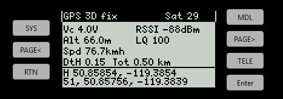
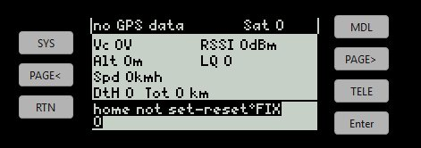
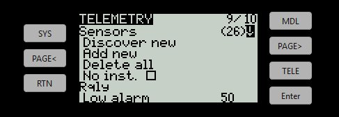
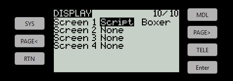
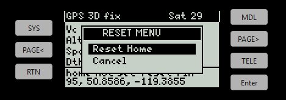
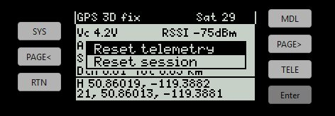
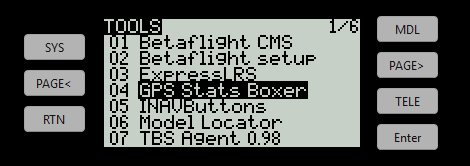
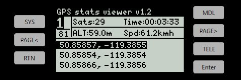

# RadioMaster Boxer GPS Telemetry Script

A lightweight, stripped-down, completely text-based EdgeTX/OpenTX telemetry script and companion stats viewer optimized specifically for the **RadioMaster Boxer** (black and white 128x64 pixel display).

This project is forked from [moschotto/OpenTX_GPS_Telemetry](https://github.com/moschotto/OpenTX_GPS_Telemetry) and stripped down to support only the Boxer layout, adding essential ExpressLRS/Crossfire telemetry fields, and eliminating all bitmaps to save transmitter memory.

> [!WARNING]
> **ExpressLRS (ELRS) Telemetry Ratio Warning:**
> By default, the ELRS telemetry ratio is typically set to `1:64` or similar, which means telemetry data (like GPS coordinates) is only sent to the radio once every few seconds. This latency is even worse when using a low packet rate like 50Hz (common for long range) compared to 250Hz.
> 
> **How to Fix:**
> 1. Open the ExpressLRS Lua script on your radio (**SYS** -> **Tools** -> **ExpressLRS**).
> 2. Locate the **Telem Ratio** setting.
> 3. Change it to a faster ratio (e.g., `1:8`, `1:4`, or `1:2`). This ensures your GPS coordinates and telemetry fields update in real-time.

---

## Key Features (Boxer Specific)

- **Optimized Layout:** Re-flowed 128x64 display structure tailored for the Boxer screen, presenting data in a clean two-column grid.
  
  | Active GPS Fix | No Telemetry / Disconnected |
  | :---: | :---: |
  |  |  |

- **No Bitmaps Required:** Completely text-based. No `/BMP` folder or icon files are required, reducing installation size and memory footprint.
- **New Telemetry Fields:** Displays five crucial on-screen telemetry fields not shown in the original:
  - `Vc`: Cell voltage (calculated/average per-cell battery voltage)
  - `Alt`: Real-time altitude (m)
  - `Spd`: Ground speed (km/h)
  - `RSSI`: Link RSSI (in dBm, CRSF `1RSS`/`RSS`/`RSSI`)
  - `LQ`: Link Quality % (CRSF `RQly`/`RQLY`)
- **Automatic Home Point Capture (Arm-based):** 
  - Captures the home position automatically when you **ARM** the model (detected from the Betaflight `FM` flight-mode telemetry sensor).
  - Resets the trip distance and previous coordinate reference on arming, ensuring each flight starts clean.
  - Falls back to the first solid GPS fix if no flight mode (`FM`) sensor is discovered.
  - Manual override is always available via a short-press of the **ENTER** key (click wheel) to open the custom Reset Menu.
- **Improved Speed Unit Handling:** Includes configurable speed multiplier (`SPEED_MULT`) to prevent over-reading speed when using CRSF/ELRS (which reports km/h directly) versus FrSky (which reports knots).

---

## Repository Files

- **`Boxer.lua`**: The telemetry screen script. Place this in `/SCRIPTS/TELEMETRY/`.
- **`GPS Stats Boxer.lua`**: The companion GPS log viewer utility. Place this in `/SCRIPTS/TOOLS/`.

---

## Installation

1. Copy [Boxer.lua](file:///d:/Temp/Antigravity/Boxer%20Telemetry%20Widget/Boxer.lua) to `/SCRIPTS/TELEMETRY/` on your radio's SD card.
2. Copy [GPS Stats Boxer.lua](file:///d:/Temp/Antigravity/Boxer%20Telemetry%20Widget/GPS%20Stats%20Boxer.lua) to `/SCRIPTS/TOOLS/` on your radio's SD card.
3. Ensure the `/LOGS/` folder exists at the root of your SD card. (Create it if it's missing, as it is needed to save the GPS log file `GPSpositions.txt`).
4. Discover your telemetry sensors in the EdgeTX/OpenTX Telemetry menu. Ensure sensors like `GPS`, `Alt`, `Spd`, `FM` (flight mode), `RxBt`/`Cels`, and `RQly`/`1RSS` are active.
   
   

5. In your Model Settings, navigate to the **Display** page, configure a screen as **Telemetry**, and choose the `Boxer` script.
   
   

---

## Usage & Controls

### Main Telemetry Screen
- **Arming:** When you arm your drone, the script automatically captures the home point once a solid GPS fix is active, resetting both the trip distance and home coordinates.
- **Manual Reset:** Short-press (click) the **ENTER** wheel on your Boxer. A custom **RESET MENU** popup will overlay on the screen. Scroll to select **Reset Home** and click **ENTER** to confirm (or select **Cancel** / press the **EXIT** button to dismiss).
  
  

- **Transmitter System Reset Menu:** Long-press the **ENTER** wheel to open the radio's native system Reset menu (Reset flight, Reset telemetry, etc.). The script's home point is **not** affected by this menu.
  
  

### GPS Log Viewer
- Go to the **SYS** menu on your Boxer, navigate to **Tools**, and select **GPS Stats Boxer**.
  
  

- You can cycle through recorded GPS coordinates page-by-page. Extremely useful for finding a lost model when telemetry is lost.
  
  

---

## Configuration

Open [Boxer.lua](file:///d:/Temp/Antigravity/Boxer%20Telemetry%20Widget/Boxer.lua) in a text editor to customize the config block at the top:

```lua
local HOME_MODE     = "hybrid" -- "hybrid", "arm", "switch", "fix", or "manual"
local HOME_MIN_SATS = 6        -- Minimum satellites before home may be set automatically
local SPEED_MULT    = 1.0      -- 1.0 for ELRS/CRSF (km/h), 1.852 for FrSky (knots -> km/h)
```

---

## License

This project is licensed under the **GNU General Public License v2 (GPLv2)**. See the original project link at [moschotto/OpenTX_GPS_Telemetry](https://github.com/moschotto/OpenTX_GPS_Telemetry) for more details.
